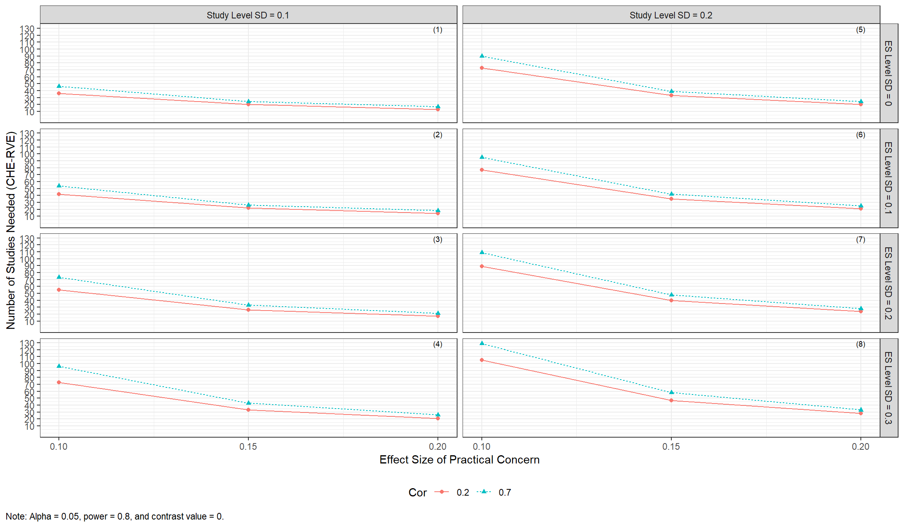
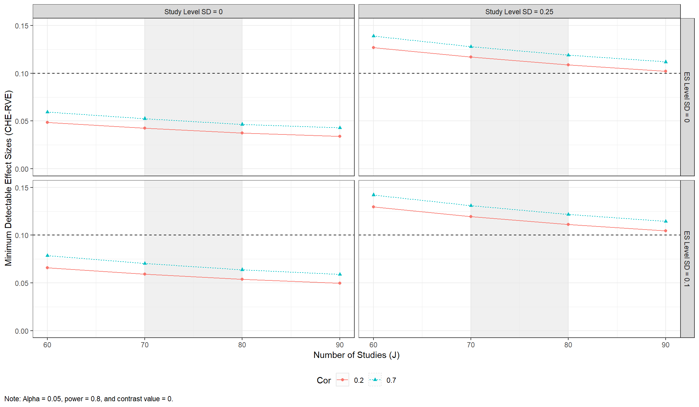

<!-- README.md is generated from README.Rmd. Please edit that file -->


# POMADE

<!-- badges: start -->
<!-- badges: end -->

The goal of the POMADE package is to provide approximation and plot
functions for conducting power analysis of the correlated-hierarchical
effects (CHE), multi-level meta-analysis (MLMA), and correlated-effects
(CE) models for meta-analysis of dependent effect sizes developed and
tested by Vembye, Pustejovsky, & Pigott (2022). These approximations
replace Hedges & Pigott’s (2001) previous power approximation based on
the assumption of independence between effect sizes which has been shown
to work inadequately to predict power for models that handle dependent
effect sizes.

## Installation

You can install the development version from
[GitHub](https://github.com/) with:

``` r
# install.packages("devtools")
devtools::install_github("MikkelVembye/POMADE")
```

## Example

### Power for finding the smallest effect size of pratical/substantial concern

Example of how to approximate power for the CHE-RVE model (Pustejovsky &
Tipton, 2021)

``` r
library(POMADE)
library(dplyr)

#?VWB22_pilot
coteach_dat <- VWB22_pilot
#glimpse(coteach_dat)

dat_kjsigma2j <- select(coteach_dat, kj, sigma2j = vg_ms_mean)

power_CHE_RVE_empirical <- 
 power_CHE(
  J = 76,
  tau2 = 0.1^2,
  omega2 = 0.25^2,
  beta = 0.1,
  rho = 0.7,
  var_df = "RVE",
  sigma2_method = "empirical",
  pilot_data_kjsigma2 = dat_kjsigma2j,
  alpha = 0.05,
  seed = 10052510
)

power_CHE_RVE_empirical
#> # A tibble: 1 x 7
#>   samp_method        method     es   var_b    df power_sig05 iterations
#>   <chr>              <chr>   <dbl>   <dbl> <dbl>       <dbl>      <dbl>
#> 1 empirical sigma2js CHE-RVE   0.1 0.00134  40.9       0.761        100
```

Making a power plot to assess power across a range of plausible
scenarios

``` r
power_CHE_RVE_plot <- 
  power_plot(
    J = seq(50, 100, 10), 
    tau2 = c(0, 0.05, 0.1, 0.2)^2,
    omega2 = c(0.05, 0.15, 0.25, 0.35)^2,
    beta = 0.1,
    rho = c(.2, .4, .7, .9),
    model = "CHE",  # Default
    var_df = "RVE", # Default
    pilot_data_kjsigma2 = dat_kjsigma2j,
    expected_studies = c(66, 86),
    iterations = 1, # Default 100
    seed = 10052510
    
  )

power_CHE_RVE_plot
```


### Number of studies needed to obtained the smallest ES of interest

The power approximation formulas can, furthermore, be used to understand
how many studies are needed to find a given effect size considered to be
the smallest of practical concern. This can be conducted via

``` r
find_J_CHE(
  mu = 0.1,
  tau2 = 0.1^2,
  omega2 = 0.25^2,
  rho = 0.7,
  pilot_data_kjsigma2 = dat_kjsigma2j,
  seed = 10052510
)
#> # A tibble: 1 x 6
#>   samp_method       method  alpha target_power J_needed iterations
#>   <chr>             <chr>   <dbl>        <dbl>    <dbl>      <dbl>
#> 1 empirical sigma2s CHE-RVE  0.05          0.8       84        100
```

and plotted via

``` r
J_plot1 <- find_J_plot(

  mu = 0.1,
  tau2 = c(0, 0.05, 0.1, 0.2)^2,
  omega2 = c(0.05, 0.15, 0.25, 0.35)^2,
  rho = c(.2, .4, .7, .9),
  pilot_data_kjsigma2 = dat_kjsigma2j,
  iterations = 1,
  seed = 10052510

)

J_plot1
```


Alternatively, reviewers investigate how the number of studies needed
varies across the assumed value of the smallest effect effect of
practical concern.

``` r
J_plot2 <- 
  find_J_plot(
    
    mu = c(0.1, 0.15, 0.2),
    tau2 = c(0, 0.05, 0.1, 0.2)^2,
    omega2 = c(0.05, 0.15, 0.25, 0.35)^2,
    rho = c(.2, .4, .7, .9),
    pilot_data_kjsigma2 = dat_kjsigma2j,
    iterations = 1,
    seed = 10052510
    
  ); J_plot2
```



### Minimum Detectable Effect Size (MDES)

It is, moreover, possible to obtained the minimum detectable effect size
(MDES) with a preset level of significance and power. This can, for
example, be obtained from

``` r
MDES_CHE(
 J = 60,
 var_df = "RVE",
 tau2 = 0.2^2,
 omega2 = 0.1^2,
 rho = 0.7,
 pilot_data_kjsigma2 = dat_kjsigma2j,
 seed = 08042022
)
#> # A tibble: 1 x 6
#>   samp_method       method  alpha target_power  MDES iterations
#>   <chr>             <chr>   <dbl>        <dbl> <dbl>      <dbl>
#> 1 empirical sigma2s CHE-RVE  0.05          0.8 0.128        100
```

and plotted across plausible scenarios via

``` r
# As default the function set alpha = .05 and power = .8

MDES_CHE_plot <- 
  MDES_plot(
    
    J = seq(50, 100, 10),
    tau2 = c(0, 0.05, 0.1, 0.2)^2,
    omega2 = c(0.05, 0.15, 0.25, 0.35)^2,
    rho = c(.2, .4, .7, .9),
    pilot_data_kjsigma2 = dat_kjsigma2j,
    iterations = 1, # Default = 100
    seed = 10052510,
    expected_studies = c(66, 86)
)

MDES_CHE_plot
```



### Color plot

``` r
power_CHE_RVE_color_plot <- 
  power_plot(
    J = seq(50, 100, 10), 
    tau2 = c(0, 0.05, 0.1, 0.2)^2,
    omega2 = c(0.05, 0.15, 0.25, 0.35)^2,
    beta = 0.1,
    rho = c(.2, .4, .7, .9),
    model = "CHE",
    var_df = "RVE",
    pilot_data_kjsigma2 = dat_kjsigma2j,
    expected_studies = c(66, 86),
    color = TRUE,
    color_brewer = TRUE,
    iterations = 1, # Default 100
    seed = 10052510
  )

power_CHE_RVE_color_plot 
```


### Traffic light power plot

Traffic light power plot aiming to flesh out the likelihood of the given
assumptions made by the reviewers

``` r
# To save plot use below commands
#png("traffic_light_power_plot.png", height = 7,  width = 12, units = "in", res = 600)
#dev.off()
traffic_light_power_plot(
  power_plot = power_CHE_RVE_color_plot,
  assumptions = c("unlikely", "likely", "expected", "likely", 
                  "unlikely", "likely", "expected", "unlikely")
)
```


# Acknowledgments

Thanks to [Savhannah Schulz](https://savhannahschulz.netlify.app/) for
making our hex stickers.

# Reference

Hedges & Pigott (2001). The Power of Statistical Tests in Meta-Analysis.
*Psychological Methods*, 6(3), 203

Pustejovsky & Tipton (2021). Meta-analysis with Robust Variance
Estimation: Expanding the range of working models. *Prevention Science*,
1-14

Vembye, Pustejovsky, & Pigott (2022). Power Approximations for
Meta-Analysis of Dependent Effect sizes.
<https://osf.io/preprints/metaarxiv/6tp9y/>
